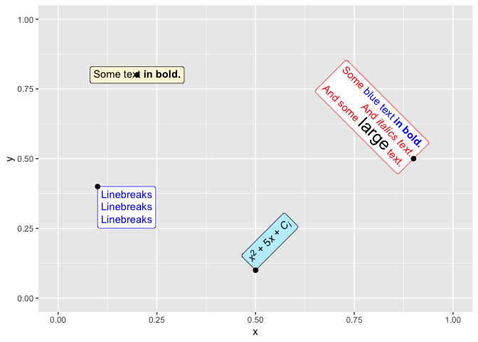
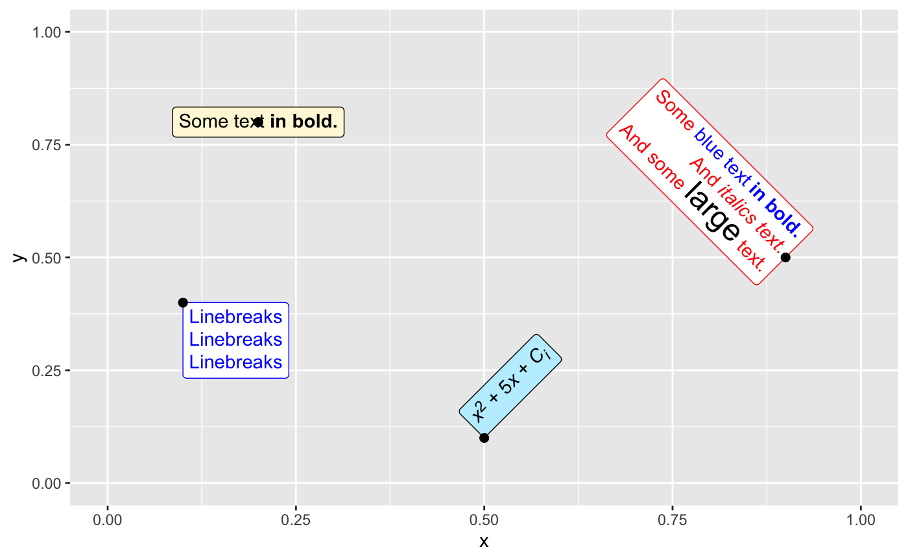
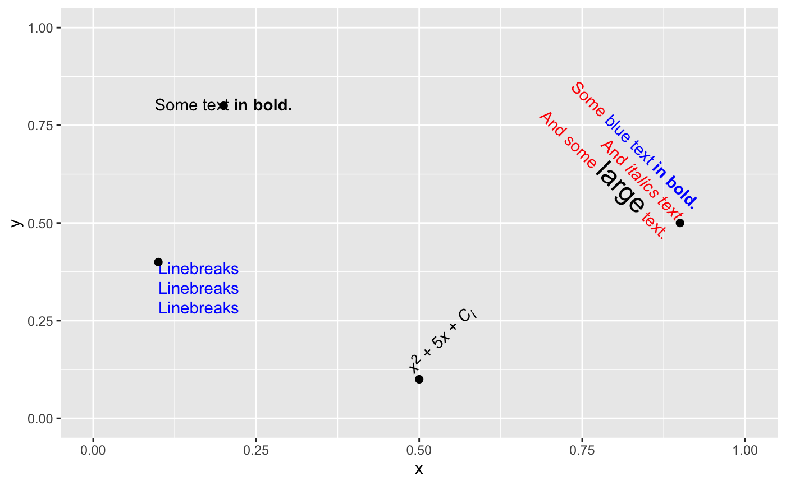
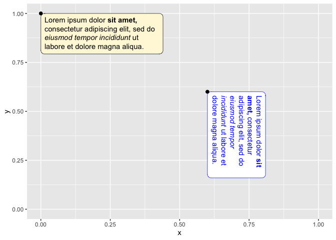

<!-- README.md is generated from README.Rmd. Please edit that file -->

# ggtext: Improved text rendering support for ggplot2

<!-- badges: start -->

[](https://github.com/wilkelab/ggtext/actions/workflows/R-CMD-check.yaml)
[](https://codecov.io/github/wilkelab/ggtext?branch=master)
[](https://cran.r-project.org/package=ggtext)
[](https://lifecycle.r-lib.org/articles/stages.html#maturing)
<!-- badges: end -->

The ggtext package provides simple Markdown and HTML rendering for
ggplot2. Under the hood, the package uses the
[gridtext](https://CRAN.R-project.org/package=gridtext) package for the
actual rendering, and consequently it is limited to the feature set
provided by gridtext.

Support is provided for Markdown both in theme elements (plot titles,
subtitles, captions, axis labels, legends, etc.) and in geoms (similar
to `geom_text()`). In both cases, there are two alternatives, one for
creating simple text labels and one for creating text boxes with word
wrapping.

Importantly, the gridtext package that provides the rendering support
**implements only an extremely limited subset of Markdown/HTML/CSS.** It
currently can make text bold or italics, can change the font, color, or
size of a piece of text, can place text as sub- or superscript, and has
extremely rudimentary image support. No other features are currently
supported. As a general rule, any Markdown, HTML, or CSS feature that
isn’t shown in any of the ggtext or gridtext documentation likely
doesn’t exist.

## Installation

You can install the latest stable release from CRAN via
`install.packages()`:

``` r
install.packages("ggtext")
```

To install the latest development version of this package, please run
the following line in your R console:

``` r
remotes::install_github("wilkelab/ggtext")
```

## Markdown in theme elements

The ggtext package defines two new theme elements, `element_markdown()`
and `element_textbox()`. Both behave similarly to `element_text()` but
render the provided text as markdown/html. `element_markdown()` is meant
as a direct replacement for `element_text()`, and it renders text
without word wrapping. To start a new line, use the `<br>` tag or add
two spaces before the end of a line.

As an example, we can mix regular, italics, and bold text, and we can
also apply colors to axis tick labels. This particular example was
inspired by [this stackoverflow
post.](https://stackoverflow.com/questions/39282293/r-ggplot2-using-italics-and-non-italics-in-the-same-category-label)

``` r
library(tidyverse)
library(ggtext)
library(glue)

data <- tibble(
  bactname = c("Staphylococcaceae", "Moraxella", "Streptococcus", "Acinetobacter"),
  OTUname = c("OTU 1", "OTU 2", "OTU 3", "OTU 4"),
  value = c(-0.5, 0.5, 2, 3)
)

data %>% mutate(
  color = c("#009E73", "#D55E00", "#0072B2", "#000000"),
  name = glue("<i style='color:{color}'>{bactname}</i> ({OTUname})"),
  name = fct_reorder(name, value)
)  %>%
  ggplot(aes(value, name, fill = color)) + 
  geom_col(alpha = 0.5) + 
  scale_fill_identity() +
  labs(caption = "Example posted on **stackoverflow.com**<br>(using made-up data)") +
  theme(
    axis.text.y = element_markdown(),
    plot.caption = element_markdown(lineheight = 1.2)
  )
```

<!-- -->

Very basic support for the `` tag exists, and it can be used, for
example, to employ images as axis labels.

``` r
labels <- c(
  setosa = "<br>*I. setosa*",
  virginica = "<br>*I. virginica*",
  versicolor = "<br>*I. versicolor*"
)

ggplot(iris, aes(Species, Sepal.Width)) +
  geom_boxplot() +
  scale_x_discrete(
    name = NULL,
    labels = labels
  ) +
  theme(
    axis.text.x = element_markdown(color = "black", size = 11)
  )
```

<!-- -->

`element_textbox()` offers support for rendering larger amounts of text
that require word wrapping. Unlike `element_markdown()`, it cannot be
used for axis tick labels, and it cannot draw text at arbitrary angles,
only at fixed orientations corresponding to 0, 90, 180, and 270 degrees.
In practice, you will usually want to use `element_textbox_simple()`
instead of `element_textbox()`, as it sets useful defaults for many
parameters not usually defined in ggplot2 themes.

``` r
ggplot(mtcars, aes(disp, mpg)) + 
  geom_point() +
  labs(
    title = "<b>Fuel economy vs. engine displacement</b><br>
    <span style = 'font-size:10pt'>Lorem ipsum *dolor sit amet,*
    consectetur adipiscing elit, **sed do eiusmod tempor incididunt** ut
    labore et dolore magna aliqua. <span style = 'color:red;'>Ut enim
    ad minim veniam,</span> quis nostrud exercitation ullamco laboris nisi
    ut aliquip ex ea commodo consequat.</span>",
    x = "displacement (in<sup>3</sup>)",
    y = "Miles per gallon (mpg)<br><span style = 'font-size:8pt'>A measure of
    the car's fuel efficiency.</span>"
  ) +
  theme(
    plot.title.position = "plot",
    plot.title = element_textbox_simple(
      size = 13,
      lineheight = 1,
      padding = margin(5.5, 5.5, 5.5, 5.5),
      margin = margin(0, 0, 5.5, 0),
      fill = "cornsilk"
    ),
    axis.title.x = element_textbox_simple(
      width = NULL,
      padding = margin(4, 4, 4, 4),
      margin = margin(4, 0, 0, 0),
      linetype = 1,
      r = grid::unit(8, "pt"),
      fill = "azure1"
    ),
    axis.title.y = element_textbox_simple(
      hjust = 0,
      orientation = "left-rotated",
      minwidth = unit(1, "in"),
      maxwidth = unit(2, "in"),
      padding = margin(4, 4, 2, 4),
      margin = margin(0, 0, 2, 0),
      fill = "lightsteelblue1"
    )
  )
```

<!-- -->

Another example, replacing facet strips with text boxes.

``` r
library(cowplot)

ggplot(mpg, aes(cty, hwy)) + 
  geom_point() +
  facet_wrap(~class) +
  theme_half_open(12) +
  background_grid() +
  theme(
    strip.background = element_blank(),
    strip.text = element_textbox(
      size = 12,
      color = "white", fill = "#5D729D", box.color = "#4A618C",
      halign = 0.5, linetype = 1, r = unit(5, "pt"), width = unit(1, "npc"),
      padding = margin(2, 0, 1, 0), margin = margin(3, 3, 3, 3)
    )
  )
```

<!-- -->

## Geoms

The geom `geom_richtext()` provides markdown/html labels. Unlike
`geom_label()`, the labels can be rotated.

``` r
df <- tibble(
  label = c(
    "Some text **in bold.**",
    "Linebreaks<br>Linebreaks<br>Linebreaks",
    "*x*<sup>2</sup> + 5*x* + *C*<sub>*i*</sub>",
    "Some <span style='color:blue'>blue text **in bold.**</span><br>And *italics text.*<br>
    And some <span style='font-size:18pt; color:black'>large</span> text."
  ),
  x = c(.2, .1, .5, .9),
  y = c(.8, .4, .1, .5),
  hjust = c(0.5, 0, 0, 1),
  vjust = c(0.5, 1, 0, 0.5),
  angle = c(0, 0, 45, -45),
  color = c("black", "blue", "black", "red"),
  fill = c("cornsilk", "white", "lightblue1", "white")
)


ggplot(df) +
  aes(
    x, y, label = label, angle = angle, color = color, fill = fill,
    hjust = hjust, vjust = vjust
  ) +
  geom_richtext() +
  geom_point(color = "black", size = 2) +
  scale_color_identity() +
  scale_fill_identity() +
  xlim(0, 1) + ylim(0, 1)
```

<!-- -->

Labels without frame or background are also possible.

``` r
ggplot(df) +
  aes(
    x, y, label = label, angle = angle, color = color,
    hjust = hjust, vjust = vjust
  ) +
  geom_richtext(
    fill = NA, label.color = NA, # remove background and outline
    label.padding = grid::unit(rep(0, 4), "pt") # remove padding
  ) +
  geom_point(color = "black", size = 2) +
  scale_color_identity() +
  xlim(0, 1) + ylim(0, 1)
```

<!-- -->

The geom `geom_textbox()` can draw boxes with word-wrapped text. It does
not support arbitrary rotation angles, only fixed orientations, just
like `element_textbox()`.

``` r
df <- tibble(
  label = rep("Lorem ipsum dolor **sit amet,** consectetur adipiscing elit,
    sed do *eiusmod tempor incididunt* ut labore et dolore magna
    aliqua.", 2),
  x = c(0, .6),
  y = c(1, .6),
  hjust = c(0, 0),
  vjust = c(1, 0),
  orientation = c("upright", "right-rotated"),
  color = c("black", "blue"),
  fill = c("cornsilk", "white")
)

ggplot(df) +
  aes(
    x, y, label = label, color = color, fill = fill,
    hjust = hjust, vjust = vjust,
    orientation = orientation
  ) +
  geom_textbox(width = unit(0.4, "npc")) +
  geom_point(color = "black", size = 2) +
  scale_discrete_identity(aesthetics = c("color", "fill", "orientation")) +
  xlim(0, 1) + ylim(0, 1)
```

<!-- -->

## Acknowledgments

This project received [financial
support](https://www.r-consortium.org/all-projects/awarded-projects)
from the [R consortium.](https://www.r-consortium.org)


